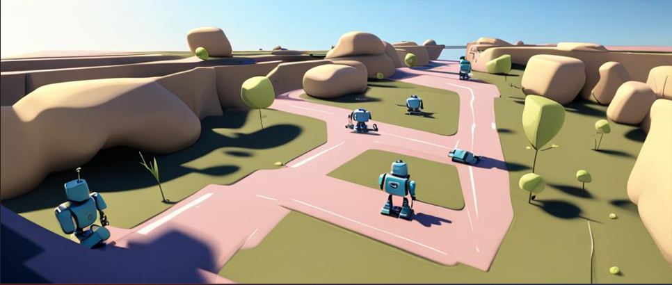

# ⚡ Multi Agent Path Finding

&nbsp;

# Abstract

<i>
The problem involves scheduling 'k' robots on a 2-D grid to minimize the overall completion time for 'k' shipment tasks. Each robot starts at a designated location, 
picks up a component, delivers it, and moves to a final destination. Obstacles on the grid must be navigated around. The objective is to optimize 
task assignments and travel paths to achieve the shortest total completion time.
</i>

#Getting Started

# Example 
